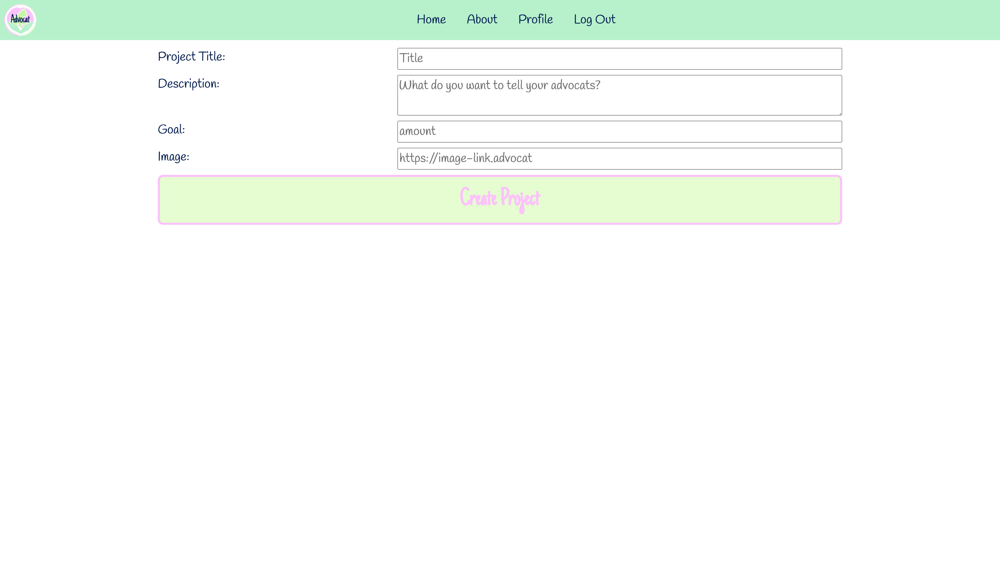
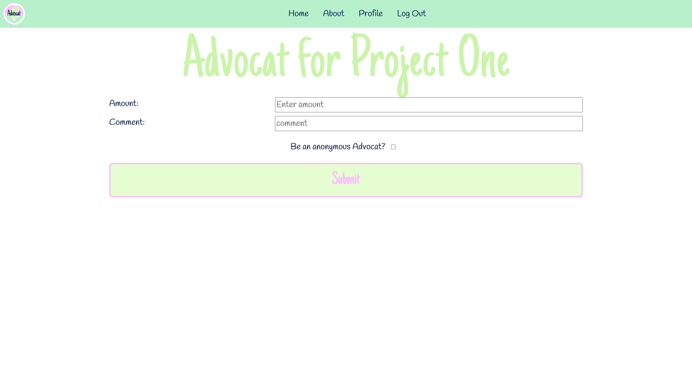
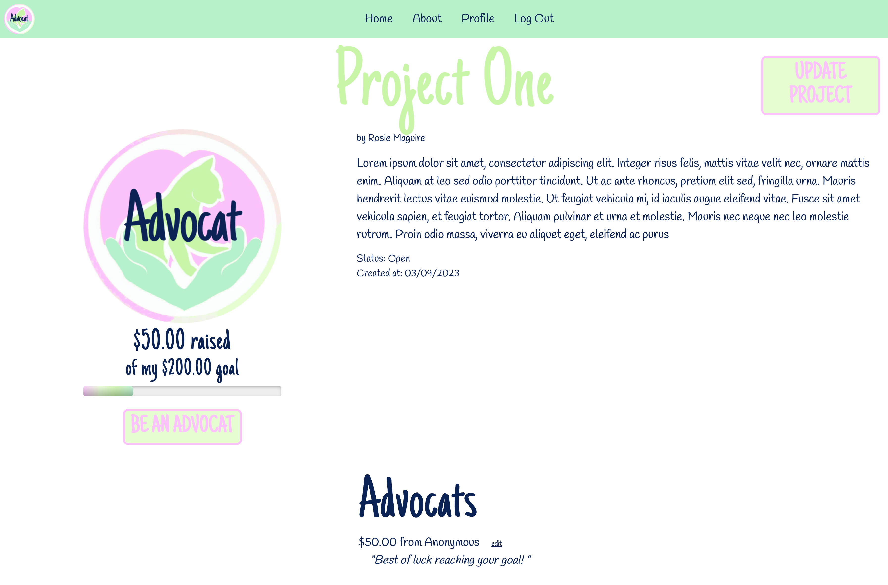
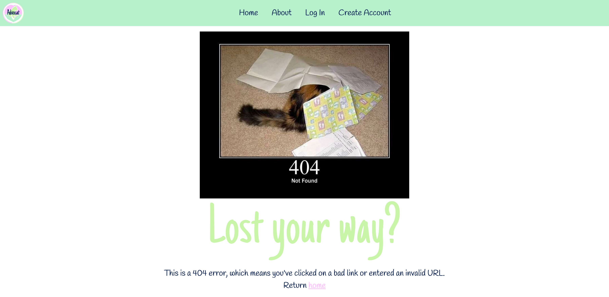

<!-- Improved compatibility of back to top link: See: https://github.com/othneildrew/Best-README-Template/pull/73 -->
<a name="readme-top"></a>
<!--
*** Thanks for checking out the Best-README-Template. If you have a suggestion
*** that would make this better, please fork the repo and create a pull request
*** or simply open an issue with the tag "enhancement".
*** Don't forget to give the project a star!
*** Thanks again! Now go create something AMAZING! :D
-->


<!-- PROJECT SHIELDS -->
<!--
*** I'm using markdown "reference style" links for readability.
*** Reference links are enclosed in brackets [ ] instead of parentheses ( ).
*** See the bottom of this document for the declaration of the reference variables
*** for contributors-url, forks-url, etc. This is an optional, concise syntax you may use.
*** https://www.markdownguide.org/basic-syntax/#reference-style-links
-->
[![Contributors][contributors-shield]][contributors-url]
[![Forks][forks-shield]][forks-url]
[![Stargazers][stars-shield]][stars-url]
[![Issues][issues-shield]][issues-url]
[![LinkedIn][linkedin-shield]][linkedin-url]


<!-- PROJECT LOGO -->
<br />
<div align="center">
  <a href="https://github.com/rosiemaguire/crowdfunding-frontend">
    
  </a>

<h3 align="center">Advocat</h3>

  <p align="center">
    She Codes crowdfunding project - React front end.
    <br />
    <a href="https://github.com/rosiemaguire/crowdfunding-frontend"><strong>Explore the docs »</strong></a>
    <br />
    <br />
    <a href="https://github.com/rosiemaguire/crowdfunding-frontend">View Demo</a>
    ·
    <a href="https://github.com/rosiemaguire/crowdfunding-frontend/issues">Report Bug</a>
    ·
    <a href="https://github.com/rosiemaguire/crowdfunding-frontend/issues">Request Feature</a>
  </p>
</div>


<!-- TABLE OF CONTENTS -->
<details>
  <summary>Table of Contents</summary>
  <ol>
    <li>
      <a href="#about-the-project">About The Project</a>
      <ul>
        <li><a href="#built-with">Built With</a></li>
      </ul>
    </li>
    <li>
      <a href="#getting-started">Getting Started</a>
      <ul>
        <li><a href="#prerequisites">Prerequisites</a></li>
        <li><a href="#installation">Installation</a></li>
      </ul>
    </li>
    <!-- <li><a href="#usage">Usage</a></li> -->
    <li><a href="#project-submission">Project Submission</a></li>
    <li><a href="#roadmap">Roadmap</a></li>
    <li><a href="#contributing">Contributing</a></li>
    <!-- <li><a href="#license">License</a></li> -->
    <li><a href="#contact">Contact</a></li>
    <!-- <li><a href="#acknowledgments">Acknowledgments</a></li> -->
  </ol>
</details>


<!-- ABOUT THE PROJECT -->
## About The Project

<!-- [![Product Name Screen Shot][product-screenshot]](https://example.com) -->

This project is the front end of a crowdfunding website which has been created to support people with raising funds for their furry children's medical expenses. You can find the back end repository [here][back-end-repo].

<p align="right">(<a href="#readme-top">back to top</a>)</p>


### Built With

* [![React][React.js]][React-url]

<p align="right">(<a href="#readme-top">back to top</a>)</p>


<!-- GETTING STARTED -->
## Getting Started

<!-- This is an example of how you may give instructions on setting up your project locally.
To get a local copy up and running follow these simple example steps. -->

### Prerequisites

This is an example of how to list things you need to use the software and how to install them.
* npm
  ```sh
  npm install npm@latest -g
  ```

### Installation

1. Clone the repo
   ```sh
   git clone https://github.com/rosiemaguire/crowdfunding-frontend.git
   ```
2. Navigate to the repo directory and install NPM packages
   ```sh
   npm install
   ```
3. Run the server
   ```sh
   npm run dev
   ```

<p align="right">(<a href="#readme-top">back to top</a>)</p>


<!-- USAGE EXAMPLES -->
<!-- ## Usage

Use this space to show useful examples of how a project can be used. Additional screenshots, code examples and demos work well in this space. You may also link to more resources.

_For more examples, please refer to the [Documentation](https://example.com)_

<p align="right">(<a href="#readme-top">back to top</a>)</p> -->

## Project Submission
- [X] A link to the deployed project
  - [Deployed site][deployed-site]
- [] A screenshot of the homepage
  - 
- [X] A screenshot of the project creation page
  - 
- [X] A screenshot of the pledge creation form
  - 
- [X] A screenshot of a project with pledges
  - 
- [X] A screenshot of the resulting page when an unauthorized user attempts to edit a project (optional, depending on whether or not this functionality makes sense in your app!)
  - The edit project link is not visible on project page if user is not owner
  - If a user that is not the owner navigates to project update page using the URL, this will redirect to a 404
  - 

<p align="right">(<a href="#readme-top">back to top</a>)</p>

<!-- ROADMAP -->
## Roadmap

- [X] Profile page with authenticated user's basic details & associated projects
- [X] Have function that calculates total donations
- [X] Have function that grabs most recent three pledges to display on Project Page
    - [X] Button to toggle view to see all pledges under3 recent pledges (similar to what has been done with projects on home page)
- [X] Implement carousel for recent projects on home page
- [ ] Check if username is already in use on the handle change, prior to post request being made for new user creation


See the [open issues][issues-url] for a full list of proposed features (and known issues).

<p align="right">(<a href="#readme-top">back to top</a>)</p>


<!-- CONTRIBUTING -->
## Contributing

Contributions are what make the open source community such an amazing place to learn, inspire, and create. Any contributions you make are **greatly appreciated**.

If you have a suggestion that would make this better, please fork the repo and create a pull request. You can also simply open an issue with the tag "enhancement".
Don't forget to give the project a star! Thanks again!

1. Fork the Project
2. Create your Feature Branch (`git checkout -b feature/AmazingFeature`)
3. Commit your Changes (`git commit -m 'Add some AmazingFeature'`)
4. Push to the Branch (`git push origin feature/AmazingFeature`)
5. Open a Pull Request

<p align="right">(<a href="#readme-top">back to top</a>)</p>


<!-- LICENSE -->
<!-- ## License

Distributed under the MIT License. See `LICENSE.txt` for more information.

<p align="right">(<a href="#readme-top">back to top</a>)</p> -->


<!-- CONTACT -->
## Contact

Rosie Maguire - [@rosie_maguire](https://www.threads.net/@rosie_maguire)

Project Link: [https://github.com/rosiemaguire/crowdfunding-frontend](https://github.com/rosiemaguire/crowdfunding-frontend)

<p align="right">(<a href="#readme-top">back to top</a>)</p>


<!-- ACKNOWLEDGMENTS -->
<!-- ## Acknowledgments

* []()
* []()
* []()

<p align="right">(<a href="#readme-top">back to top</a>)</p> -->


<!-- MARKDOWN LINKS & IMAGES -->
<!-- https://www.markdownguide.org/basic-syntax/#reference-style-links -->
[contributors-shield]: https://img.shields.io/github/contributors/rosiemaguire/crowdfunding-frontend.svg?style=for-the-badge
[contributors-url]: https://github.com/rosiemaguire/crowdfunding-frontend/graphs/contributors
[forks-shield]: https://img.shields.io/github/forks/rosiemaguire/crowdfunding-frontend.svg?style=for-the-badge
[forks-url]: https://github.com/rosiemaguire/crowdfunding-frontend/network/members
[stars-shield]: https://img.shields.io/github/stars/rosiemaguire/crowdfunding-frontend.svg?style=for-the-badge
[stars-url]: https://github.com/rosiemaguire/crowdfunding-frontend/stargazers
[issues-shield]: https://img.shields.io/github/issues/rosiemaguire/crowdfunding-frontend.svg?style=for-the-badge
[issues-url]: https://github.com/rosiemaguire/crowdfunding-frontend/issues
[linkedin-shield]: https://img.shields.io/badge/-LinkedIn-black.svg?style=for-the-badge&logo=linkedin&colorB=555
[linkedin-url]: https://linkedin.com/in/rosie-maguire-515777230
[product-screenshot]: images/screenshot.png
[React.js]: https://img.shields.io/badge/React-20232A?style=for-the-badge&logo=react&logoColor=61DAFB
[React-url]: https://reactjs.org/
[back-end-repo]:https://github.com/rosiemaguire/Django-crowd-funding-project
[deployed-site]: https://main--exquisite-semifreddo-0e0f78.netlify.app/